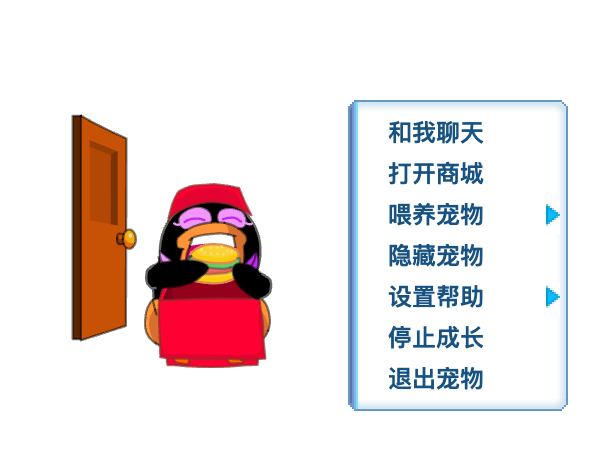
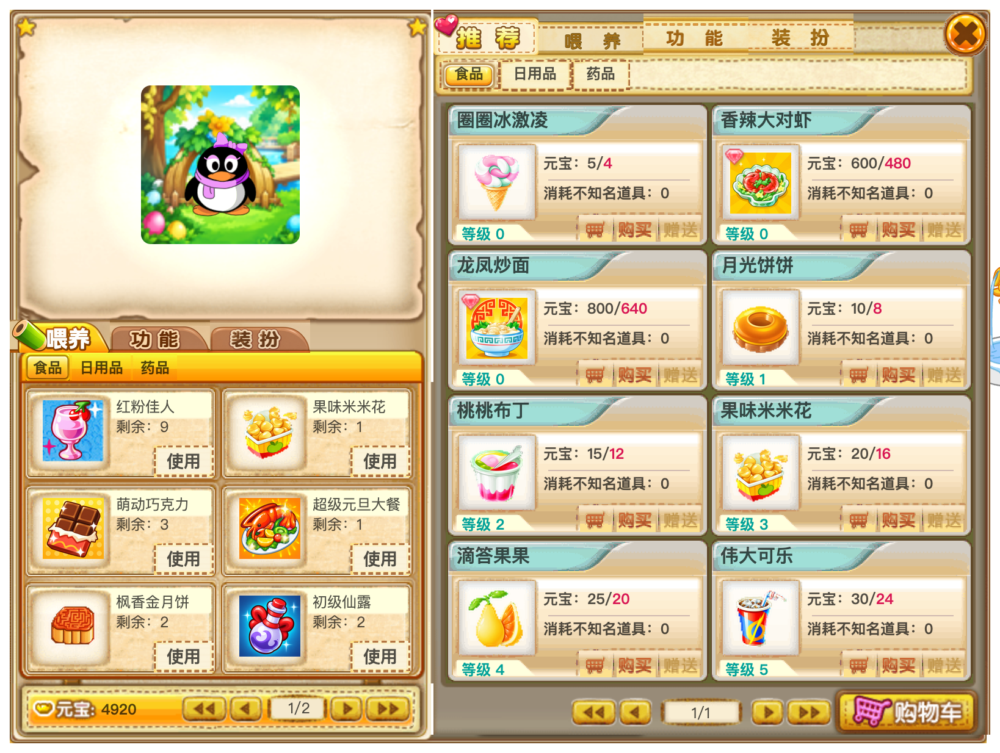
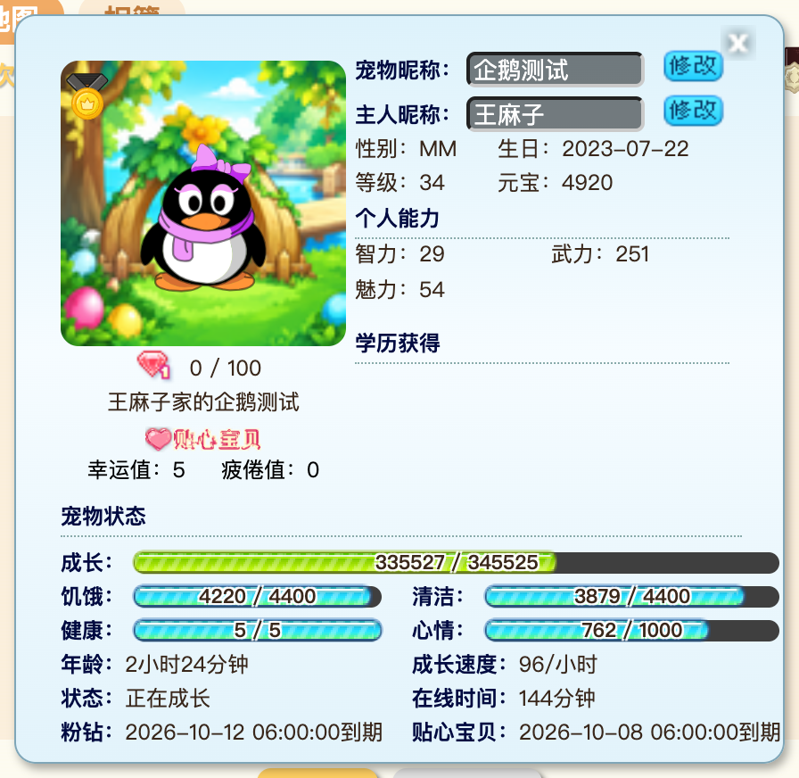
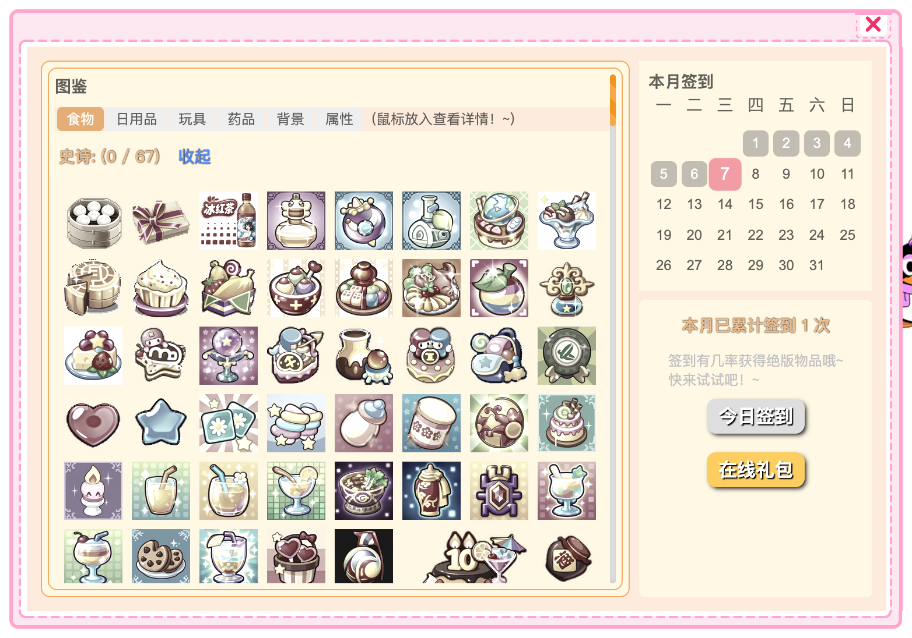
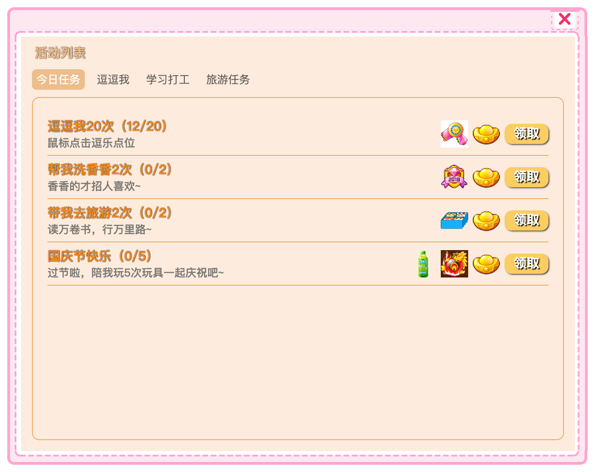
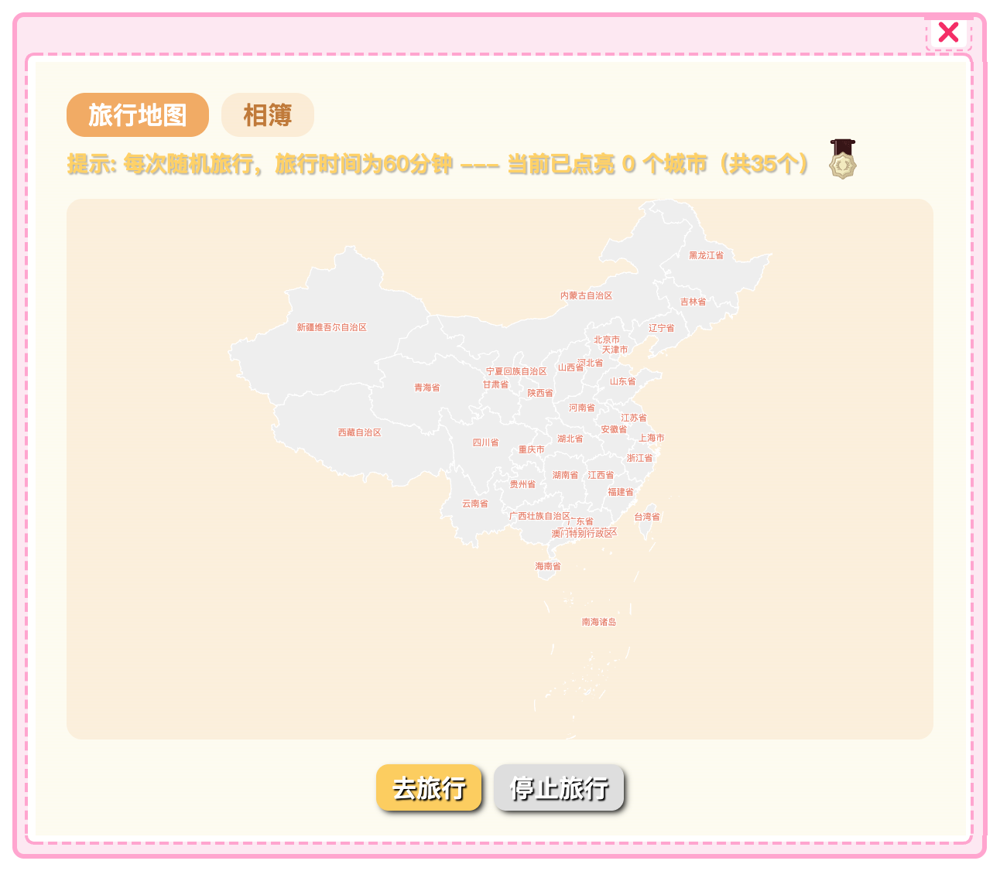
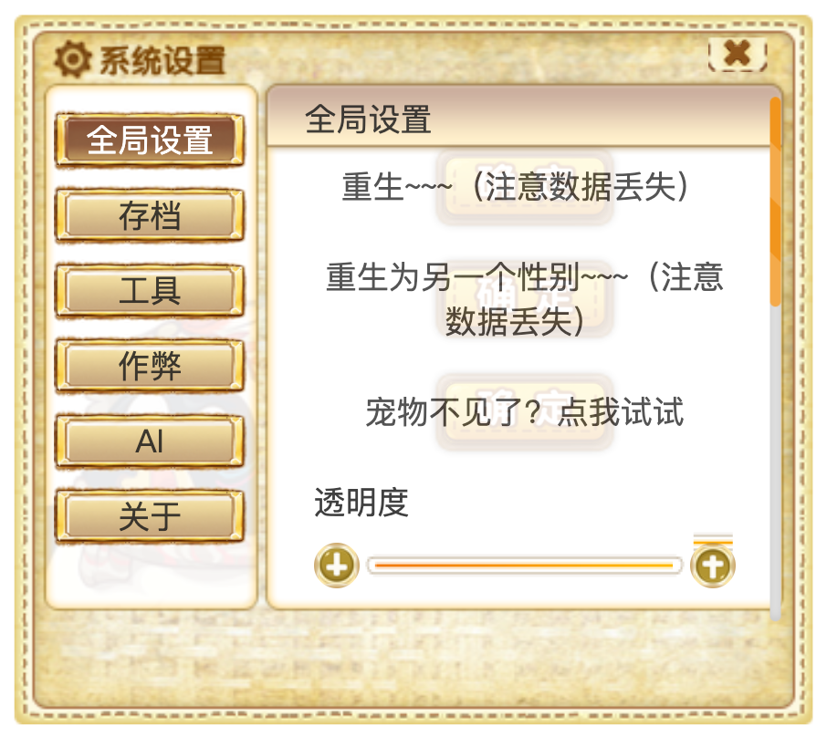

# QQPet

QQ 宠物跨平台复刻（Windows / macOS / Linux / Android / HarmonyOS），基于 Arctic Penguin T800 逆向重建。Flash 内容由 [Ruffle](https://ruffle.rs) 播放。

> **版权声明**：QQ 宠物的美术资源与 SWF 版权归腾讯所有；旅行照片素材版权归《旅行青蛙·中国之旅》所有。本项目仅供学习交流，请勿用于商业用途。

## 截图

<table>
  <tr>
    <td width="50%"><br>桌面宠物与右键菜单</td>
    <td width="50%"><br>商城与背包</td>
  </tr>
  <tr>
    <td><br>宠物资料</td>
    <td><br>图鉴与签到</td>
  </tr>
  <tr>
    <td><br>今日任务</td>
    <td><br>全国旅游</td>
  </tr>
  <tr>
    <td><br>系统设置</td>
    <td></td>
  </tr>
</table>

## 功能

- **养成**：选蛋领养、成长与升级、饥饿/清洁/心情/健康、生病就医、死亡与复活、重生（可换性别）。
- **日常**：打工、上学（含升学考试）、全国旅游（奇遇、纪念品、旅行相簿明信片），关闭应用期间的进度照常计时。
- **物品**：商城与购物车、背包、食物/清洁/药品/玩具、限时物品、粉钻与甜蜜情侣。
- **任务与邮件**：今日任务（按宠物需求和节假日生成）、逗逗我、学习打工、旅游任务；签到与图鉴；节日、生日、旅行明信片邮件。
- **活动**：池塘（养鱼）、农场（QQFarm，金币即元宝）、密室探险、6 类 98 个小游戏（独立窗口，按游戏时长奖励）。
- **AI（可选）**：接入任意 OpenAI 兼容接口，宠物闲聊、改写台词、点评或翻译剪贴板文字。
- **其他**：天气播报、节日问候、免打扰、透明度、开机自启、全屏应用（看视频、玩游戏）在前台时自动隐藏宠物、高清画质（重绘的 @2x 素材，适配高分屏，重启后生效）、存档导入导出（兼容原版 `config.json`，首次启动的选蛋页也可直接导入）。

存档位于 `userData/save.json`，导入时旧存档备份为 `save.json.bak`。

### Android

宠物以悬浮窗形式显示在桌面和其他应用上方，功能与桌面版一致，另有以下适配：

- 首次打开需允许「显示在其他应用的上层」和通知权限；通知栏常驻的通知代替桌面版的托盘图标。
- 宽面板在竖屏手机上自动旋转并铺满屏幕；横竖屏切换后宠物保持在屏幕内。
- 小游戏和密室探险全屏横屏运行，并显示可改键的虚拟手柄。
- 系统不允许后台读取剪贴板：在其他应用里选中文字后，从选择菜单或分享面板选「QQ宠物」，交给宠物点评或翻译。

### HarmonyOS

纯血鸿蒙（HarmonyOS NEXT / 5 及以上，在 7 模拟器上验证过）不能装 Android APK。宠物同样以悬浮窗显示，JS 桥和 Android 是同一份 `QQPetNative` 契约，原生壳在 `harmony/`，渲染层不改。

- 首次打开需允许「显示在其他应用的上层」和通知；通知栏通知代替桌面版的托盘图标。
- 小游戏和密室探险全屏横屏运行（`GameAbility`）。
- 系统不允许后台读剪贴板：在其他应用里分享文字给「QQ宠物」，交给宠物点评或翻译。
- 没有开机自启：当前 SDK 没有可用的开机广播扩展。
- 窗口按页面可见内容裁剪；拖动时会铺满屏幕，避免跟手错位。

本地打包：`npm run harmony`，需要本机 [DevEco Studio](https://developer.huawei.com/consumer/cn/deveco-studio/)（`harmony/hvigorw` 默认使用 `/Applications/DevEco-Studio.app`，可用 `DEVECO_SDK_HOME` / `NODE_HOME` / `JAVA_HOME` 覆盖）。产物在 `harmony/entry/build/default/outputs/default/`。

GitHub Actions 打 `v*` 标签时产出未签名 HAP 并放进 Release。和桌面包一样没有商店签名；用 hdc 装到模拟器或已开启调试的真机。上架或普通真机日常安装要在 DevEco 里配签名，目前仓库没有这份材料。

## 下载安装

从 [Releases](https://github.com/AnkioTomas/qqpet/releases/latest) 下载对应平台的安装包：

| 平台 | 文件 |
|---|---|
| Windows | `QQPet.Setup.<版本>.exe` |
| macOS（Apple 芯片） | `QQPet-<版本>-arm64.dmg` |
| macOS（Intel） | `QQPet-<版本>.dmg` |
| Linux | `QQPet-<版本>.AppImage` 或 `qqpet_<版本>_amd64.deb` |
| Android（11 及以上） | `QQPet-<版本>.apk` |
| HarmonyOS（5 及以上） | `QQPet-<版本>.hap` |

安装包**没有代码签名**，系统会拦截首次运行：

- **Windows**：SmartScreen 提示「Windows 已保护你的电脑」时，点「更多信息」→「仍要运行」。
- **macOS**：把 QQPet 拖进「应用程序」后，若提示「已损坏，无法打开」或「无法验证开发者」，在终端执行一次：

  ```bash
  xattr -cr /Applications/QQPet.app
  ```

  也可以先打开一次，再到「系统设置 → 隐私与安全性」底部点「仍要打开」。
- **Linux**：AppImage 需要可执行权限，`chmod +x QQPet-*.AppImage` 后运行；Ubuntu 22.04 起若报缺少 FUSE，安装 `libfuse2`（24.04 为 `libfuse2t64`）。deb 包用 `sudo apt install ./qqpet_*_amd64.deb` 安装。
- **Android**：在浏览器或文件管理器中打开 APK，按提示允许「安装未知应用」。
- **HarmonyOS**：下载 HAP 后用 hdc 安装（需开发者模式）：`hdc install QQPet-*.hap`。未签名，不能走应用市场那套安装。

## 征集素材

社区里能找到的 QQ 宠物原版资料很少，大量游戏画面和素材已经缺失，复刻时只能靠猜。如果你手上有下面这些东西，欢迎提供：

- **老版本客户端**：QQ 宠物的安装包或安装目录，以及老版本 QQ 留下的宠物缓存目录（里面的 SWF、图片、音效、配置文件都有用）。
- **游戏画面**：当年的截图、录屏、视频，尤其是打工、上学、旅游、小游戏、商城、节日活动等界面。
- **其他资料**：物品与宠物数据、台词文本、活动说明，或者你记得的玩法细节。

提交方式：在 [Issues](https://github.com/AnkioTomas/qqpet/issues) 发帖说明你有什么，文件较大可附网盘链接。提交的素材版权仍归腾讯所有，只用于本项目的学习复刻。

## 开发

```bash
git lfs install && git lfs pull   # resources/pet 由 Git LFS 管理
npm ci
npm run dev
```

## 构建

```bash
npm run dist      # 类型检查 + 构建 + 打包当前平台安装包到 dist/
npm run android   # Android debug APK
npm run harmony   # HarmonyOS debug HAP（需要本机 DevEco Studio）
```

推送 `v*` 标签时由 GitHub Actions 打出三平台安装包、Android APK 和 Harmony HAP 并发布 Release。其他推送不触发构建。

Android 版本地调试用 `npm run android`（debug 包，输出到 `android/app/build/outputs/apk/debug/`），需要 Android SDK 和 JDK 17（Gradle 8 不支持更新的 JDK，可用 `JAVA_HOME` 指定）。CI 打的 release 包需要在仓库 Secrets 中配置签名密钥：

| Secret | 内容 |
|---|---|
| `ANDROID_KEYSTORE_BASE64` | keystore 文件的 base64（`base64 -i release.jks`） |
| `ANDROID_KEYSTORE_PASSWORD` | keystore 密码 |
| `ANDROID_KEY_ALIAS` | 密钥别名 |
| `ANDROID_KEY_PASSWORD` | 密钥密码 |

每次发布都必须用同一个 keystore，否则已安装的用户无法覆盖升级。

## 改过的 SWF

以下文件用 [JPEXS FFDec](https://github.com/jindrapetrik/jpexs-decompiler) 打过补丁，重新导入资源时不要覆盖：

| 文件 | 改动 |
|---|---|
| `resources/pet/mstx/qq_mstx.swf` | 隐藏需要联网的「兑换礼包」「魔法爱情石」按钮 |
| `resources/pet/qqfarm/Farm.swf` | 允许在 `file://` 之外启动；「金币」改为「元宝」；商店可买的种子排前、其余置灰，购买后弹出提示；商店、仓库的弹出动画改为缩放比例，不再被异步加载的图片压窄；不绘制房屋、篱笆、狗窝 |
| `resources/pet/qqfarm/props.swf` | 素材中的「金币」文字改为「元宝」 |
| `resources/pet/smallGame/{100ceng,ball,paopao2}/` 下读屏幕尺寸的 26 个 SWF | `Capabilities.screenResolutionX/Y` 改为 `ExternalInterface.call("API.GetScreenWidth/Height")`（Ruffle 返回的是播放器自身尺寸） |

## 目录

| 路径 | 说明 |
|---|---|
| `src/main` | 主进程：窗口、托盘、`app://` 协议、存档、AI 与天气请求 |
| `src/preload` | `window.qqpet` 接口 |
| `src/renderer` | 界面（原生 TypeScript），`pet/` 为养成逻辑，`ui/` 为各窗口，`swf/` 为 Ruffle 封装 |
| `src/shared` | 主进程与渲染层共享的 IPC 与存档类型 |
| `src/android` | Android 版的 `window.qqpet` 实现，经 WebView 接口调用原生层 |
| `android/` | Android 原生工程：悬浮窗服务、游戏页、文件选择、文字分享入口、开机自启 |
| `src/harmony` | HarmonyOS 版的 `window.qqpet` 实现，经 ArkWeb 接口调用原生层 |
| `harmony/` | HarmonyOS 原生工程：浮动窗、游戏页、存档选择、分享入口 |
| `resources/pet` | 原版资源，`npm run import-assets -- <app.asar>` 可重新导入 |
| `tools/` | 反混淆脚本、原版 CSS 移植脚本、CDP 调试脚本 |

## 许可证

本项目代码以 [GPL-3.0](LICENSE) 发布。该许可证不覆盖 `resources/pet` 下的原版美术资源、SWF 与旅行照片，它们的版权归各自所有者，见文首版权声明。

## 友情链接

本项目认可 [LINUX DO](https://linux.do) 社区。
